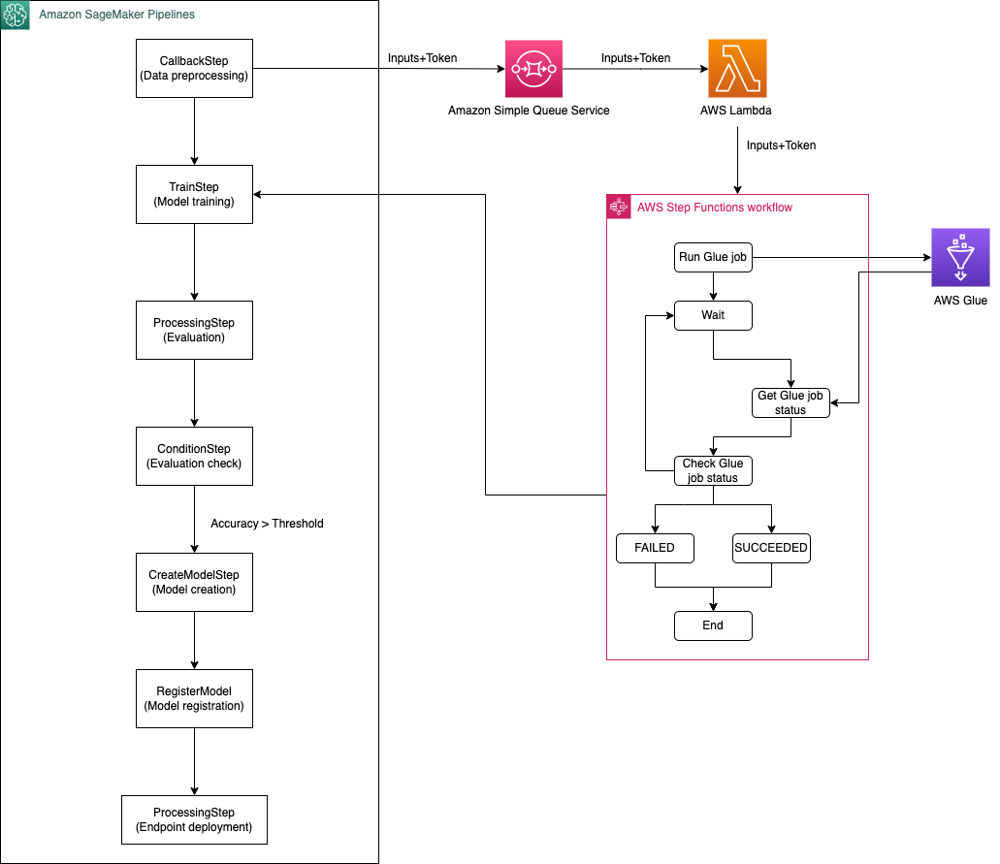

# SageMaker Pipelines Customer Churn Prediction

Amazon SageMaker Model Building Pipelines offers machine learning (ML) application developers and operations engineers the ability to orchestrate SageMaker jobs and author reproducible ML pipelines. It also enables them to deploy custom-build models for inference in real-time with low latency, run offline inferences with Batch Transform, and track lineage of artifacts. They can institute sound operational practices in deploying and monitoring production workflows, deploying model artifacts, and tracking artifact lineage through a simple interface, adhering to safety and best practice paradigms for ML application development.

The SageMaker Pipelines service supports a SageMaker Pipeline domain specific language (DSL), which is a declarative JSON specification. This DSL defines a directed acyclic graph (DAG) of pipeline parameters and SageMaker job steps. The SageMaker Python Software Developer Kit (SDK) streamlines the generation of the pipeline DSL using constructs that engineers and scientists are already familiar with.

## ML workflow with SageMaker Pipelines
The pipeline that you create follows a typical machine learning (ML) application pattern of preprocessing, training, evaluation, model creation, model registration and endpoint deployment.

    <figcaption>ML workflow with SageMaker Pipeline</figcaption>

