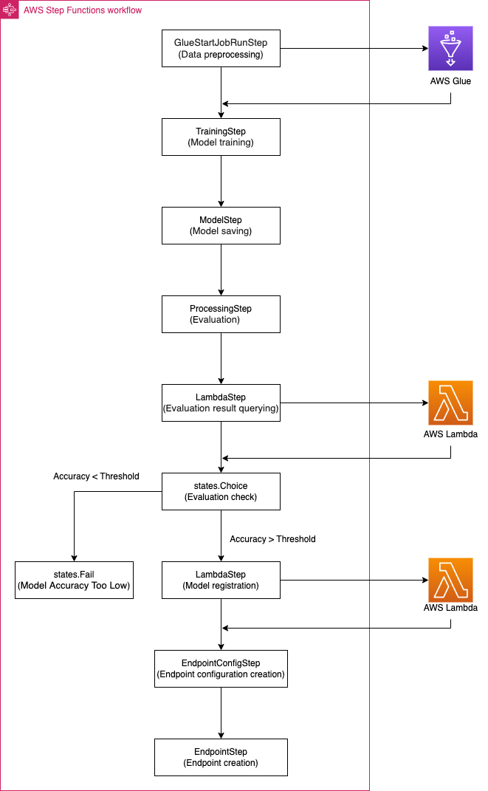

# mlops-pipeline-demo-multiple-options

In this tutorial, we create a machine learning pipeline with Step Functions Data Science SDK.

The workflow in our Step Funcitons is as below:

<figcaption>Workflow for a machine learning pipeline with AWS Step Functions Data Science SDK</figcaption>

## Resources
- Lambda function
- Glue
- SageMaker